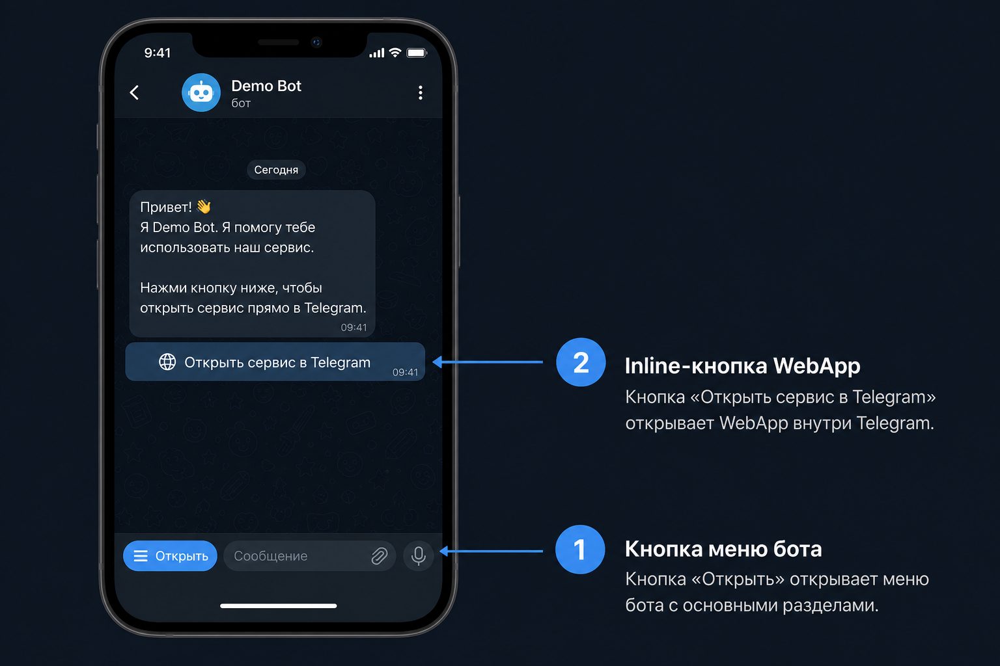
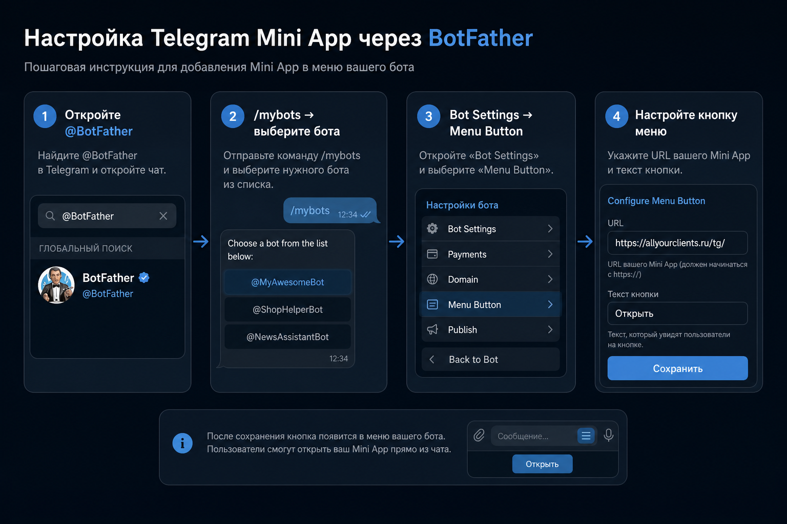

# Telegram Mini App: как открыть сайт внутри Telegram

Гайд для настройки мини-приложения (Web App), чтобы клиент и специалист открывали `allyourclients.ru` прямо в Telegram, без внешнего браузера.

## Что уже сделано в коде

После деплоя этого релиза:

1. Кнопки бота открывают сайт как **Web App** (`web_app`), а не обычную ссылку.
2. При старте бота вызывается `setChatMenuButton` → кнопка **«Открыть»** рядом с полем ввода.
3. Есть точка входа: `https://allyourclients.ru/tg/`
4. Сайт разрешает встраивание в Telegram (CSP `frame-ancestors` для `web.telegram.org` / `telegram.org`).
5. На страницах подключён `telegram-web-app.js` + bootstrap `telegram-webapp.js`.

## Как это выглядит у пользователя



1. Внизу чата рядом с полем ввода появляется кнопка **«Открыть»**.
2. В сообщениях бота кнопки вида **«Открыть сервис в Telegram»** / **«Записаться»** открывают сайт внутри Telegram.
3. Сайт разворачивается на весь экран WebView (через `Telegram.WebApp.expand()`).

## Настройка в BotFather (обязательно проверить)

Автоматический `setChatMenuButton` обычно достаточен. Если кнопки нет, настройте вручную:



1. Откройте [@BotFather](https://t.me/BotFather)
2. Команда `/mybots` → выберите вашего бота
3. `Bot Settings` → `Menu Button`
4. `Configure menu button`
5. URL: `https://allyourclients.ru/tg/`
6. Текст кнопки: `Открыть`

Дополнительно полезно:

- `/setdomain` → домен `allyourclients.ru` (нужен для Login Widget и WebApp auth)
- `/setcommands` → команды из `bot/copy.py` (`start`, `register`, `appointments`, `history`, `help`)

## HTTPS требование

Mini App работает **только по HTTPS** на публичном домене.  
`http://localhost` в Menu Button / web_app URL Telegram не примет для продакшена.

## Проверка после деплоя

1. Перезапустите бота:
   ```bash
   ./scripts/stop_bot.sh
   ./scripts/run_bot.sh
   ```
2. В логах должно быть:
   - `setChatMenuButton OK -> https://allyourclients.ru/tg/`
3. Откройте бота в Telegram → `/start`
4. Нажмите **«Открыть сервис в Telegram»** или меню **«Открыть»**
5. Должна открыться страница `/tg/` внутри Telegram
6. Перейдите в «Записаться» и пройдите запись

## Что работает сейчас / что дальше

Работает сейчас:
- Открытие сайта в Telegram WebView
- Запись клиента, навигация по публичным страницам
- Кабинет специалиста (если пользователь уже авторизован cookie-сессией)

Следующий уровень (Phase 2+):
- Авторизация через `initData` Telegram (без отдельного логина в WebView)
- Единый notification outbox
- Mobile app на том же API

## Deploy notes

После пуша в `main`:

1. Дождаться GitHub Actions deploy сайта + bot restart
2. Или вручную:
   ```bash
   ./scripts/repair_bot.sh
   ```
3. Проверить, что на сервере задан `BOT_API_SECRET` (и в web, и в bot env)
4. Hard refresh / новый чат с ботом, чтобы увидеть Menu Button

## Важно для безопасности

- Не оставляйте пустой `BOT_API_SECRET` в production
- Mini App URL должен быть только ваш домен
- Не открывайте админские опасные формы без сессии
